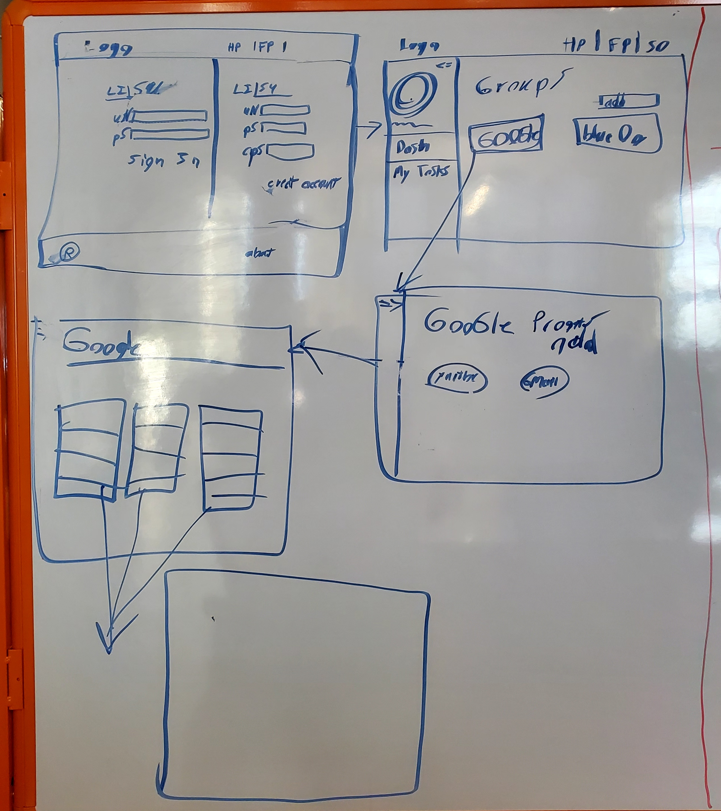

# BugNet #
## Team ##
>Project Manager/Developer: Emmanuel Ruiz  
Developer: Aldair Garcia Angon  
Developer: Aaron Minaya
---
## Heading ##
> BugNet is an application that allows project members to share tasks and bugs that need to be completed or fixed. Users are allowed to create a post with a specific description and image of the bug so they are later allowed to be resolved by other project members.
--- 
## Sub-Heading ## 
>BugNet was designed to boost the productivity levels of project members. It also provides a learning experience for incomers to learn from experienced users.
---
## Summary ##
> BugNet allows users to create a post of a task or bug they are working on and it is easily accessed. The posts can be seen by all the project members and they can lend a helping hand. They User can create an organization, add tasks, and bugs that are placed in different levels of completion. 
---
## Problem ##
> There are many bugs and tasks that project members run into that they need help with, but they don't know who to ask. This a problem that affects the productivity level of a company. 
---
## Solution ##
> With BugNet, we provide a platform where project members can post tasks and bugs they need help with. Other project members can see these posts and if they know or want to help they can quickly help the person that needs help.
---
## Key Technical Challenge ##
> Sending project problems to other team members. Applying local storage. 
---
## Extension Opportunities ##
>We would like to add organizations to our database to allow companies to manage their teams
---
## ERD Diagram. ##
>[ERD diagram.](https://drive.google.com/file/d/1d3lgJwYSnWCnFXnaHv6hVU44DdngubA7/view?usp=sharing)
---
## Wireframes ##
> 
---
## Contacts ##
>Project Manager/Developer: Emmanuel Ruiz  
LinkedIn: [Emmanuel Ruiz](https://www.linkedin.com/in/emmanuel-ruiz/)  
Github: [EmmanuelR21](https://github.com/EmmanuelR21)  
 
Developer: Aldair Garcia Angon  
LinkedIn: [Aldair Garcia Angon](https://www.linkedin.com/in/aldair-garcia-angon/)  
Github: [AGarciaNY](https://github.com/AGarciaNY)  
 
Developer: Aaron Minaya  
LinkedIn: [Aaron Minaya](https://www.linkedin.com/in/aaron-minaya/)  
Github: [aaronminaya0](https://github.com/aaronminaya0)